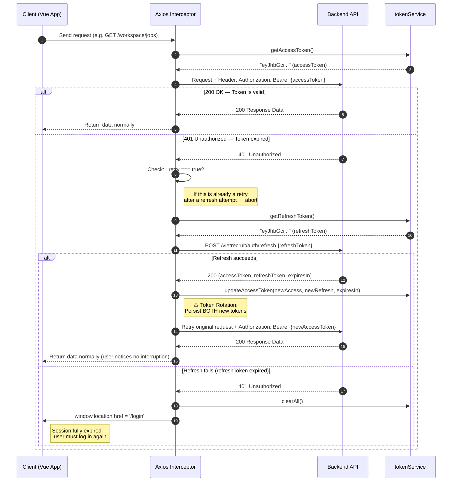
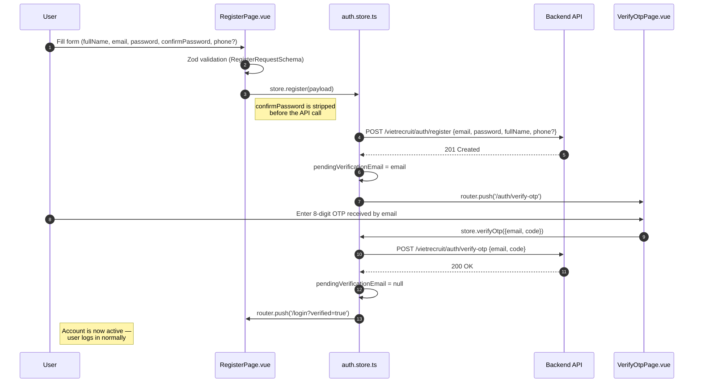

# Auth Module Architecture — VietRecruit ATS

> **Document version:** 1.0.0
> **Last updated:** 2026-03-03
> **Audience:** Frontend Developer, Tech Lead, Security Reviewer

---

## 1. Overview

The authentication module (`features/auth`) is the central security layer of the VietRecruit ATS application.
It is responsible for the full lifecycle of a user session, including:

- **Registration** and email verification via an 8-digit OTP.
- **Login** and issuance of a dual-token pair (`accessToken` + `refreshToken`).
- **Silent Refresh** — automatically renewing the Access Token upon expiry without any visible interruption to the user.
- **Logout** and complete erasure of all session data from `localStorage`.
- **Forgot Password** — sending a password-reset link via email.

This module does **not** store user profile data (name, avatar, role).
The `LoginResponse` from the API returns only tokens — there is no `user` field. This is an intentional architectural decision to enforce Separation of Concerns: profile data will be fetched by a dedicated Profile module in future iterations.

### File Scope

```
src/
├── core/
│   ├── api/
│   │   ├── axios.instance.ts      # Axios client + Request/Response Interceptors
│   │   └── token.service.ts       # Abstraction layer for all localStorage operations
│   ├── router/
│   │   ├── index.ts               # Navigation Guards
│   │   └── routes.ts              # Route definitions (includes /auth/*)
│   ├── stores/
│   │   └── auth.store.ts          # Pinia Auth Store — global session state
│   └── utils/
│       └── error.utils.ts         # Maps backend error codes → user-facing messages
│
└── features/auth/
    ├── components/
    │   └── AuthLayout.vue          # Shared split-screen layout wrapper
    ├── composables/
    │   └── useAuth.ts              # Component-facing composable
    ├── services/
    │   └── auth.service.ts         # HTTP call functions — one per endpoint
    ├── types/
    │   └── auth.dto.ts             # Zod Schemas + inferred TypeScript types
    └── views/
        ├── LoginPage.vue
        ├── RegisterPage.vue
        ├── VerifyOtpPage.vue
        └── ForgotPasswordPage.vue
```

---

## 2. Authentication Flow

### 2.1 Dual-Token System

The system uses two JWTs with distinct lifecycles:

| Token          | Purpose                                                    | Recommended TTL     | Storage        |
| -------------- | ---------------------------------------------------------- | ------------------- | -------------- |
| `accessToken`  | Authenticates every API request (`Authorization` header)   | Short (e.g. 15 min) | `localStorage` |
| `refreshToken` | Exchanges for a new `accessToken` when the current expires | Long (e.g. 30 days) | `localStorage` |

> **Security note:** `localStorage` is more susceptible to XSS attacks than `HttpOnly Cookies`.
> This is an accepted engineering trade-off for the current SPA architecture.
> If compliance requirements escalate (PCI-DSS, HIPAA), the system should migrate to
> `HttpOnly Cookies` with server-side CSRF protection.

### 2.2 Token Rotation

The backend enforces **Token Rotation**: every successful call to
`POST /vietrecruit/auth/refresh` invalidates the previous Refresh Token immediately
and returns **both** a new Access Token and a new Refresh Token. The frontend
**must** persist both new values.

```typescript
// src/core/api/token.service.ts

// ✅ CORRECT — persist both tokens after Token Rotation
tokenService.updateAccessToken(accessToken, newRefreshToken, expiresIn);

// ❌ WRONG — saving only the accessToken invalidates the still-valid refreshToken
tokenService.setAccessToken(accessToken);
```

### 2.3 Sequence Diagram: Silent Refresh Token Flow



### 2.4 Registration & OTP Verification Flow



---

## 3. Data Transfer Objects (DTOs)

All DTOs are defined as **Zod Schemas** in `src/features/auth/types/auth.dto.ts`.
TypeScript types are inferred automatically — **no manual `interface` declarations**.

### 3.1 Shared Response Envelope — `ApiResponse<T>`

Every backend response is wrapped in the following envelope:

```typescript
// src/features/auth/types/auth.dto.ts
export const ApiResponseSchema = <T extends z.ZodTypeAny>(dataSchema: T) =>
  z.object({
    success: z.boolean(),
    code: z.string().optional(), // Backend error code (e.g. "AUTH_001")
    message: z.string(),
    data: dataSchema, // Actual payload (generic)
    timestamp: z.string().optional(),
  });
```

### 3.2 `LoginResponseDTO`

> **⚠️ Important:** `LoginResponse` does **not** contain user profile data
> (`id`, `email`, `fullName`, `role`...). This is per the OpenAPI 3.1 specification.

```typescript
export const LoginResponseSchema = z.object({
  accessToken: z.string(),
  refreshToken: z.string(),
  expiresIn: z.number(), // In seconds
  tokenType: z.string().default("Bearer"),
});
export type LoginResponse = z.infer<typeof LoginResponseSchema>;
```

### 3.3 `TokenRefreshResponseDTO`

```typescript
// Both tokens change after Token Rotation
export const TokenRefreshResponseSchema = z.object({
  accessToken: z.string(),
  refreshToken: z.string(), // ← Always persist this new value
  expiresIn: z.number(),
});
export type TokenRefreshResponse = z.infer<typeof TokenRefreshResponseSchema>;
```

### 3.4 `VerifyOtpRequestDTO`

> **⚠️ The field name is `code`, not `otp`** — strictly per the OpenAPI specification.

```typescript
export const VerifyOtpRequestSchema = z.object({
  email: z.string({ message: "Email is required" }).email("Invalid email"),
  code: z
    .string({ message: "Please enter the verification code" })
    .length(8, "Code must be exactly 8 digits")
    .regex(/^\d{8}$/, "Code must contain digits only"),
});
```

### 3.5 All 7 Endpoints Summary

| #   | Method | Path                                | Request DTO             | Response DTO                        |
| --- | ------ | ----------------------------------- | ----------------------- | ----------------------------------- |
| 1   | POST   | `/vietrecruit/auth/login`           | `LoginRequest`          | `ApiResponse<LoginResponse>`        |
| 2   | POST   | `/vietrecruit/auth/register`        | `RegisterApiPayload`    | `ApiResponse<void>`                 |
| 3   | POST   | `/vietrecruit/auth/verify-otp`      | `VerifyOtpRequest`      | `ApiResponse<void>`                 |
| 4   | POST   | `/vietrecruit/auth/resend-otp`      | `ResendOtpRequest`      | `ApiResponse<void>`                 |
| 5   | POST   | `/vietrecruit/auth/refresh`         | `TokenRefreshRequest`   | `ApiResponse<TokenRefreshResponse>` |
| 6   | POST   | `/vietrecruit/auth/logout`          | _(no body)_             | `ApiResponse<void>`                 |
| 7   | POST   | `/vietrecruit/auth/forgot-password` | `ForgotPasswordRequest` | `ApiResponse<void>`                 |

> `RegisterApiPayload` = `RegisterRequest` minus the `confirmPassword` field.
> `confirmPassword` is a UI-only field — it **must not** be sent to the API.

---

## 4. Security Policies

### 4.1 XSS (Cross-Site Scripting) Risk

**Risk:** Tokens stored in `localStorage` can be read by any JavaScript running on the same
page — including malicious scripts injected via XSS attacks.

**Current mitigations:**

| Mitigation                        | Description                                              |
| --------------------------------- | -------------------------------------------------------- |
| Content Security Policy (CSP)     | Configured at CDN/Nginx level to restrict script sources |
| No sensitive data in localStorage | Only tokens are stored — no PII (name, email, role)      |
| Short Access Token TTL            | Short-lived tokens limit the attack window               |
| Zod Runtime Validation            | Blocks mutated or malformed payloads before processing   |

### 4.2 CSRF (Cross-Site Request Forgery) Risk

**Why CSRF is not a concern here:** Because tokens are transmitted via the
`Authorization: Bearer {token}` header rather than cookies, the browser does **not**
automatically attach them to cross-origin requests. Classic CSRF attacks are therefore
ineffective against a Bearer Token architecture.

### 4.3 Strict API Response Typing

Every API response **must** go through the `ApiResponse<T>` wrapper. Direct type-casting
is strictly forbidden:

```typescript
// ❌ FORBIDDEN — no runtime validation
const data = response.data as LoginResponse;

// ✅ REQUIRED — typed via Axios generic in auth.service.ts
const { data } = await apiClient.post<{ data: LoginResponse }>(
  `${BASE}/login`,
  payload,
);
return data.data; // Shape is guaranteed by the TypeScript generic
```

### 4.4 Error Handling Rules

All API errors are processed through `parseApiError()` in `src/core/utils/error.utils.ts`.
This function maps backend error codes to user-facing messages:

```typescript
const ERROR_CODE_MAP: Record<string, string> = {
  AUTH_001: "Incorrect email or password.",
  AUTH_003: "Account not yet verified. Please check your email.",
  AUTH_004: "Verification code is incorrect or has expired.",
  AUTH_005: "This email address is already registered.",
  RATE_LIMIT: "Too many attempts. Please try again later.",
  // ...
};
```

---

## 5. Key Architecture Decisions

| Decision                                               | Rationale                                                                        |
| ------------------------------------------------------ | -------------------------------------------------------------------------------- |
| `confirmPassword` is UI-only, never sent to the API    | Strictly per OpenAPI spec — the backend does not accept this field               |
| `LoginResponse` contains no `user` data                | Separation of Concerns — profile data is fetched by a dedicated module           |
| Refresh token call uses plain `axios`, not `apiClient` | Avoids recursive interceptor loop when the refresh endpoint itself returns 401   |
| `pendingVerificationEmail` lives in Pinia              | Passes the email from `RegisterPage` to `VerifyOtpPage` without query params     |
| Logout always clears `localStorage`                    | Even when the server call fails — guarantees local session consistency           |
| Navigation Guard uses `hasSession()` directly          | Checks token existence only; does not decode JWT (avoids premature Pinia access) |
